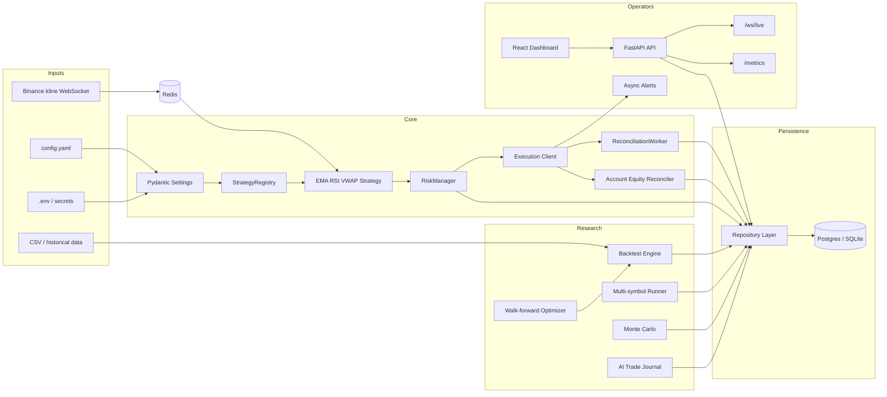

# LWK Futures Trading Bot

[](https://github.com/preethve11/lwk-futures-Trading-Bot/actions/workflows/ci.yml)

Production-oriented automated crypto futures trading platform for Binance USDT-M Futures. The project includes a strategy engine, risk controls, exchange execution safety, persistence, FastAPI operator API, React dashboard, backtesting, optimization, simulation, market-data streaming, monitoring, and deployment assets.

This repository is built for research, testnet operation, and engineering portfolio review. Treat real-money trading as an additional production-hardening phase, not a default mode.

## What Is Included

- EMA/RSI/VWAP/volume scalping strategy with ATR stops and take-profits.
- Strict risk controls: fixed dollar risk, daily loss lock, drawdown lock, risk-reward checks, min notional, manual pause, and kill switch.
- Binance Futures execution client with symbol-info caching and live trading guard.
- Order protection state machine and reconciliation worker for SL/TP verification and emergency close.
- Live account/equity reconciliation with wallet snapshots, drift alerts, dashboard visibility, and Prometheus gauges.
- SQLAlchemy persistence for sessions, signals, orders, positions, trades, risk events, backtests, and AI reports.
- Repository layer for database access.
- FastAPI operator API with token auth, WebSocket live events, readiness, and Prometheus metrics.
- React/Vite dashboard for live status, risk controls, trades, backtests, equity curve, logs/events, and AI journal output.
- Multi-symbol backtesting, JSON report export, walk-forward optimization, and Monte Carlo simulation.
- Binance WebSocket kline market-data service with Redis pub/sub/cache.
- Advisory-only AI trade journal. AI can explain decisions but cannot place orders or mutate trading state.
- Docker Compose stack for backend, frontend, Postgres, Redis, optional market-data worker, Prometheus, and Grafana.
- CI pipeline with lint, strict app mypy, tests, frontend build, Docker builds, Compose config, and gitleaks secret scanning.

## Architecture



More detail: [docs/architecture.md](docs/architecture.md)

## 5-Minute Testnet Quickstart

1. Install Python 3.11+, Node 22+, Docker Desktop, and Docker Compose.
2. Clone the repo and install backend dependencies:

```powershell
py -m pip install -r requirements.txt
```

3. Copy `.env.example` to `.env`, then fill only testnet-safe values:

```env
USE_TESTNET=true
CONFIRM_LIVE_TRADING=false
BINANCE_TESTNET_API_KEY=...
BINANCE_TESTNET_API_SECRET=...
API_TOKEN=local-dev-token
```

4. Run local verification:

```powershell
py -m pytest tests/ -q --basetemp C:\Users\Preethve\lwk-futures-Trading-Bot\pytest_tmp
py -m ruff check .
py -m mypy app --strict
```

5. Start the platform:

```powershell
docker compose --profile monitoring up --build
```

6. Open:

- Dashboard: `http://localhost:8080`
- API docs: `http://localhost:8000/docs`
- Prometheus: `http://localhost:9090`
- Grafana: `http://localhost:3000`

Full guide: [docs/testnet-quickstart.md](docs/testnet-quickstart.md)

## Common Commands

```powershell
# Backtest
py main.py backtest

# Multi-symbol backtest, using SYMBOLS from env or config.yaml
py main.py backtest-multi --report-json reports/backtests/multi.json

# Walk-forward optimization
py main.py walk-forward --report-json reports/optimizations/walk_forward.json

# Monte Carlo simulation
py main.py monte-carlo --returns-json reports/backtests/example.json --report-json reports/monte_carlo/example.json

# API
py main.py api --host 127.0.0.1 --port 8000

# Market-data WebSocket worker
py main.py market-data

# Database migrations
py main.py db-upgrade --revision head
py main.py db-current

# Account/equity reconciliation
py main.py reconcile-account --asset USDT

# Exchange lifecycle reconciliation
py main.py reconcile-lifecycle --limit 100

# Live loop, testnet first
py main.py live
```

## API Surface

Key endpoints:

- `GET /health`
- `GET /ready`
- `GET /metrics`
- `GET /configs`, `POST /configs`
- `GET /backtests`, `POST /backtests/run`, `POST /backtests/run-multi`
- `GET /trades`, `GET /trades/{id}`
- `GET /sessions`, `POST /sessions/start`, `POST /sessions/stop`
- `GET /risk/state`, `POST /risk/state`, `POST /risk/kill-switch`, `GET /risk/events`
- `GET /signals`
- `GET /positions`
- `GET /account/snapshots`
- `GET /ai-reports`
- `WebSocket /ws/live`

Protected operator routes use `X-API-Token` or `Authorization: Bearer <token>` when `API_TOKEN` is configured.

## Safety Position

This project is deliberately conservative:

- Mainnet requires `USE_TESTNET=false` and `CONFIRM_LIVE_TRADING=true`.
- The live loop must not block on Telegram, AI, or dashboard calls.
- SL/TP protection is verified after entry.
- Failed protection can trigger emergency close and manual review.
- Live account equity is persisted from Binance wallet state and drift emits operator alerts.
- AI reports are advisory-only and cannot call execution clients or mutate state.
- Metrics and logs are operational aids, not trading signals.

Read before live use: [docs/safety.md](docs/safety.md)

## Backtesting And Research

Reports include Sharpe, Sortino, max drawdown, win rate, profit factor, average R:R, equity curves, and JSON export paths. Use walk-forward and Monte Carlo before trusting a parameter set.

Example report: [docs/example-backtest-report.md](docs/example-backtest-report.md)

## Deployment

Local production-style stack:

```powershell
docker compose up --build
docker compose --profile market-data up --build
docker compose --profile monitoring up --build
```

Deployment and incident runbook: [docs/deployment-monitoring.md](docs/deployment-monitoring.md)

Database migrations: [docs/database-migrations.md](docs/database-migrations.md)

## Repository Map

```text
app/
  ai/              advisory-only AI journal
  analytics/       Monte Carlo simulation
  api/             FastAPI app, routers, schemas, event bus
  backtesting/     multi-symbol and walk-forward tooling
  core/            Pydantic settings
  market_data/     Binance WebSocket + Redis market data
  monitoring/      readiness and Prometheus metrics
  persistence/     SQLAlchemy models, repositories, state machine
  strategies/      strategy registry
  workers/         live trader and reconciliation worker
frontend/          React/Vite operator dashboard
monitoring/        Prometheus and Grafana provisioning
deploy/            deployment env templates
docs/              operator and roadmap documentation
tests/             backend tests
trading_bot/       core strategy, risk, execution, analytics primitives
```

## Verification

Current CI runs:

- `ruff check .`
- `mypy app --strict --ignore-missing-imports`
- `pytest tests/`
- market-data CLI smoke
- Monte Carlo CLI smoke
- frontend install/test/build
- backend Docker build
- frontend Docker build
- base Compose config
- monitoring Compose config
- gitleaks secret scan

Local full check:

```powershell
py -m pytest tests/ -q --basetemp C:\Users\Preethve\lwk-futures-Trading-Bot\pytest_tmp
py -m ruff check .
py -m mypy app --strict
npm test --prefix frontend
npm run build --prefix frontend
docker compose config
docker compose --profile monitoring config
```

## Roadmap Status

Completed:

- Day 1: CI, tests, Pydantic settings foundation, live trading guard, backtest date filtering, historical data loading.
- Day 2: runtime refactor, settings wrapper, structured logging, strategy registry, live worker, Binance symbol cache.
- Day 3: persistence models, repositories, DB helpers, order state machine, live/backtest persistence hooks.
- Day 4: reconciliation worker, protected order result, alert severity, async alert queue, emergency path tests.
- Day 5: FastAPI API, token auth, repository-backed routes, WebSocket live events.
- Day 6: React dashboard shell and core operator pages.
- Day 7: multi-symbol backtesting, JSON reports, Docker Compose with Postgres/Redis/frontend/backend.
- Week 2: market-data WebSocket/Redis service, walk-forward optimizer, Monte Carlo simulation, AI trade journal, deployment monitoring.
- Production hardening: exchange lifecycle reconciliation, failed-unprotected recovery, exchange-fill ledger, Alembic migrations, and account/equity reconciliation.

Still recommended:

- Mainnet dry-run checklist and small-notional test protocol.
- VPS TLS/reverse-proxy automation.
- Backup and restore automation.
- More frontend component and WebSocket tests.

## Contributing

See [CONTRIBUTING.md](CONTRIBUTING.md).

## Security

Do not commit secrets. Report security issues using [SECURITY.md](SECURITY.md).

## License

MIT License. See [LICENSE](LICENSE).
