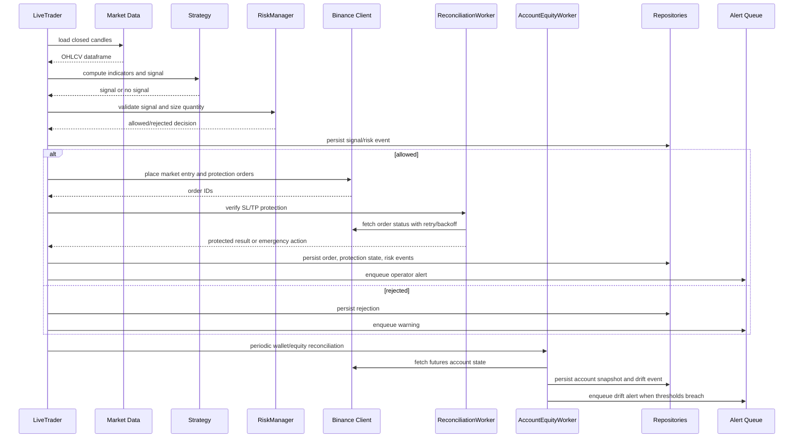
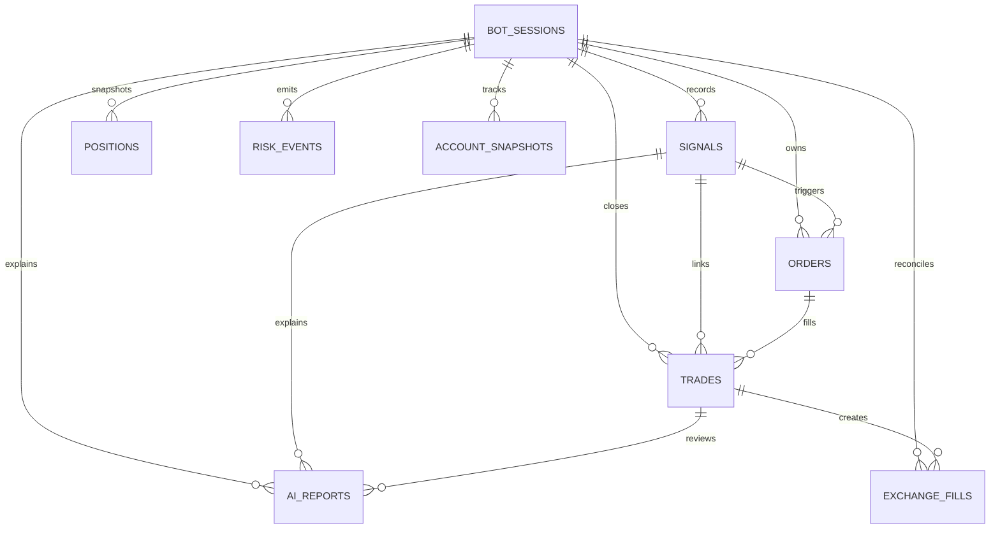

# Architecture

This project is split into operational layers so strategy logic, risk controls, execution, persistence, and operator tooling can evolve independently.

## Runtime Flow



## Main Packages

- `app/core`: typed settings and config loading.
- `app/strategies`: strategy registry and app-facing strategy creation.
- `trading_bot/strategies`: strategy primitives and EMA/RSI/VWAP implementation.
- `trading_bot/risk`: position sizing and risk validation.
- `trading_bot/execution`: exchange abstraction and Binance Futures adapter.
- `app/workers`: live trading loop and reconciliation worker.
- `app/persistence`: SQLAlchemy models, repositories, DB helpers, and order state machine.
- `app/api`: FastAPI app, routers, schemas, event bus, and route services.
- `frontend`: React/Vite operator dashboard.
- `app/market_data`: Binance WebSocket kline service and Redis integration.
- `app/backtesting`: multi-symbol and walk-forward tooling.
- `app/analytics`: Monte Carlo simulation.
- `app/ai`: advisory-only trade journal service.
- `app/monitoring`: readiness probes and Prometheus metrics.

## Persistence Model



Models currently include:

- `BotSessionModel`
- `ConfigModel`
- `RiskStateModel`
- `SignalModel`
- `OrderModel`
- `PositionModel`
- `TradeModel`
- `ExchangeFillModel`
- `AccountSnapshotModel`
- `RiskEventModel`
- `BacktestRunModel`
- `AIReportModel`

## Execution Safety

Order protection state is tracked through:

- `PENDING`
- `ENTRY_PLACED`
- `TP_PLACED`
- `SL_PLACED`
- `PROTECTED`
- `FAILED_UNPROTECTED`

After a market entry, reconciliation verifies stop-loss and take-profit protection on Binance. Missing protection is retried with backoff. If protection is still absent, the worker can trigger emergency close, persist manual-review state, and emit critical alerts.

Exchange lifecycle reconciliation polls order status, aggregates partial fills, syncs position snapshots, detects position drift, and cancels stale reduce-only protection when Binance reports the account is flat.

Account equity reconciliation polls Binance wallet state, persists a live equity curve, exposes dashboard/API visibility, and emits balance drift alerts when configured thresholds are breached.

## API And Dashboard

The dashboard talks to FastAPI through a small API client layer. The API uses repository classes rather than scattered direct SQLAlchemy queries. Live updates are pushed through `/ws/live`.

Operator routes are token-protected when `API_TOKEN` is configured. In production, an empty API token is rejected.

## Market Data

The market-data worker subscribes to Binance kline streams and publishes closed-candle updates to Redis. The live strategy loop can run from Redis market data or REST polling, controlled by `MARKET_DATA_SOURCE`.

## Research Tooling

Backtesting and research features share the same strategy and risk primitives where practical:

- Single-symbol backtest
- Multi-symbol aggregate backtest
- Walk-forward optimization with Optuna
- Monte Carlo simulation from trade returns
- JSON report export

## Monitoring

FastAPI exposes:

- `/health`: process liveness
- `/ready`: readiness and optional DB check
- `/metrics`: Prometheus scrape endpoint

Compose can run Prometheus and Grafana with:

```powershell
docker compose --profile monitoring up --build
```

## Deferred Production Hardening

- Full backup and restore automation.
- TLS/reverse proxy automation.
- More extensive dashboard and WebSocket tests.
- Exchange-led fill reconciliation from Binance user-data streams.

